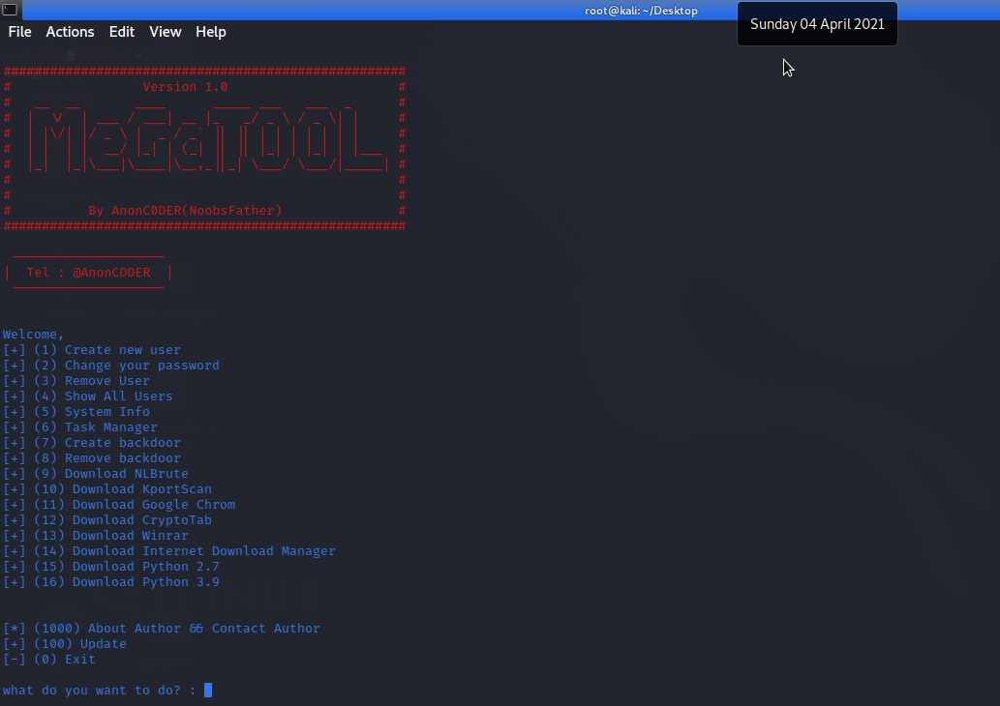

# MeGaTOOL
**### Hi everyone, This is a script to make things easier on virtual servers or even home systems.
This is my first professional Python script in version 3. And now its available for free at Github. You can use this script and even customize it for yourself. But thank you for helping me improve the script.
And don't forget to let me know if there are any bugs.**

### Requirements :

- python v3
- pip install colorama
- https://git-scm.com/download/win (in windows, for script updates)

### Menu :

1. Create new user
2. Change your password
3. Remove User
4. Show All Users
5. System Info
6. Task Manager
7. Create backdoor
8. Remove backdoor
9. Download NLBrute
10. Download KportScan
11. Download Google Chrom
12. Download CryptoTab
13. Download Winrar
14. Download Internet Download Manager
15. Download Python 2.7
16. Download Python 3.9

### Screenshot : 

Contact me : 
AnonCODER@tutanota.com
telegram : @NoobsFather
My Website : Magna-Game.site
